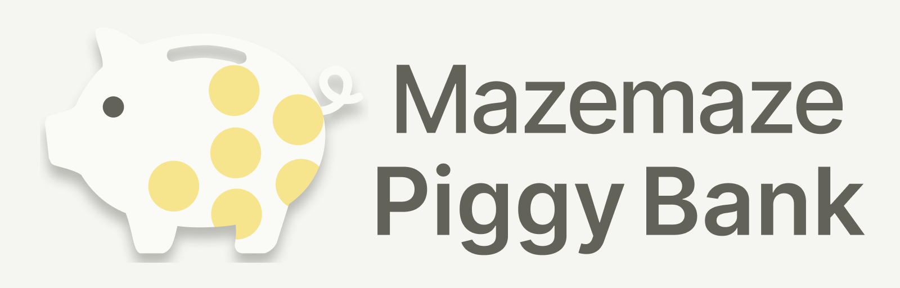

# Mazemaze Piggy Bank

<picture>
  <source media="(prefers-color-scheme: dark)" srcset="docs/brand/lockup-horizontal-dark.png" />
  <source media="(prefers-color-scheme: light)" srcset="docs/brand/lockup-horizontal.png" />
  
</picture>

A Progressive Web App (PWA) designed to manually manage multiple asset accounts and allocate funds to specific "Savings Goals" to track progress.

Instead of using a dedicated backend server, this application adopts a serverless architecture using **Microsoft OneDrive** directly as the database, prioritizing user privacy and data ownership.

## 📖 Overview & Purpose

This app is not just an expense tracker or a simple asset manager; it focuses on clarifying "which asset is reserved for what purpose."

- **Asset Allocation**: Manually link assets (Positions such as Cash, Bank Deposits, Investment Funds) to specific Goals (e.g., Travel, Big Purchases) by assigning reserved amounts (Allocations).
- **Market Value Adjustment**: When the market value of an asset (e.g., Investment Trust) is updated, the allocated amounts linked to that asset are **automatically recalculated proportionally**.
- **Sharing**: Manage a "Shared Pool Account" and "Shared Goals" with partners or family members using OneDrive's sharing capabilities.

## ✨ Features

- **Microsoft Account Only**: No proprietary account registration required.
- **Fully Serverless (Client-to-OneDrive)**: All data is stored in the user's personal OneDrive (default: `/Apps/Mazemaze Piggy Bank/`).
- **Mobile First**: UI designed for one-handed operation on smartphones.
- **Microsoft Fluent UI**: Adopts a design system that is both friendly and professional.
- **Offline Viewing**: Browse the latest cached data even without an internet connection (Editing is disabled offline).

## 🛠 Tech Stack

- **Frontend**: Next.js / React / TypeScript
- **UI Framework**: Fluent UI
- **Auth & Storage**: Microsoft Graph API (OneDrive) / MSAL
- **Data Strategy**: Snapshot (Latest State) + Event Sourcing (Logs)

## ⚠️ Constraints & Scope

This app focuses on digitizing "personal manual management" and explicitly excludes the following features:

1.  **No Automatic Sync**: No bank APIs or scraping. All balances and market values are entered manually.
2.  **JPY (Integer) Only**: Foreign currencies and investment funds are handled as integer JPY values (converted manually at input).
3.  **Conflict Resolution (First-in Wins)**:
    - The app does not support simultaneous editing or automatic merging.
    - If a newer version exists on the server when saving (ETag mismatch), the save will fail, and the user must reload the latest data.
4.  **No Real-time Sync**: While a "Lease" file is used to show an "Editing" status to others, strictly real-time locking or synchronization is not implemented.

## 📁 Data Storage

Data is stored in the user's OneDrive in the following structure.
**Note**: Deleting the root folder will reset the application (all data will be lost).

- **Snapshot**: A normalized JSON file holding the current state of Accounts, Positions, Goals, and Allocations.
- **Events**: Chunked log files for auditing and recovery.
- **Lease**: Temporary files used to control the UX for concurrent editing conflicts.
- **Shared data**: Shared folders must live under `/Apps/Mazemaze Piggy Bank/shared/` to appear in the Shared list.

---

> **Note**
> While designed as a PWA for mobile use, this application is fully functional on desktop browsers. Recommended browsers: Latest Chrome, Edge, Safari.

## ✅ Setup

```bash
npm install
```

Create your local env file:

```bash
cp .env.example .env.local
```

## 🔐 Microsoft Sign-in Setup

This app supports **Personal Microsoft accounts only**.

1. Create a Microsoft Entra app registration for a single-page application.
2. Add a redirect URI for local development (for example, `http://localhost:3000`).
3. Configure delegated Microsoft Graph permissions:
   - `User.Read`
   - `Files.ReadWrite`
4. Update `.env.local` with your values:
   - `NEXT_PUBLIC_MSAL_CLIENT_ID`
   - `NEXT_PUBLIC_MSAL_REDIRECT_URI`
   - `NEXT_PUBLIC_MSAL_AUTHORITY` (recommended: `https://login.microsoftonline.com/consumers`)
   - `NEXT_PUBLIC_ONEDRIVE_APP_ROOT` (recommended: `/Apps/Mazemaze Piggy Bank/`)

### OneDrive Smoke Test

1. Start the dev server.
2. Open **Settings**.
3. Sign in and confirm the status shows your account.
4. Run **Check app folder**.
5. Run **Write test file** and **Read test file**.

The test file name is `pb-test.json` under the app folder.

## ▶️ Development

```bash
npm run dev
```

Open [http://localhost:3000](http://localhost:3000).

## 🔍 Quality Commands

```bash
npm run format
npm run lint
npm run typecheck
npm test
npm run check
```

## 🚀 Deployment

Deployments are performed via **GitHub Actions** using the Vercel CLI.
To avoid double-deploys, Vercel's Git integration deployment should be disabled by `vercel.json`.

### Dev environment

The dev environment is intended to be **non-public**. Do not share the dev URL outside collaborators.

#### Vercel Project (dev)

1. Create a dedicated Vercel project for dev.
2. Configure Environment Variables on the Vercel project (dev):
   - `NEXT_PUBLIC_MSAL_CLIENT_ID`
   - `NEXT_PUBLIC_MSAL_REDIRECT_URI` (set to the dev base URL used by the project)
   - `NEXT_PUBLIC_MSAL_AUTHORITY` (recommended: `https://login.microsoftonline.com/consumers`)
   - `NEXT_PUBLIC_ONEDRIVE_APP_ROOT` (recommended: `/Apps/Mazemaze Piggy Bank/`)

> Note: `NEXT_PUBLIC_MSAL_REDIRECT_URI` must be registered on the Microsoft Entra app as a Redirect URI.

#### GitHub Actions (dev)

##### Required GitHub Secrets

Set these secrets in the GitHub repository settings:

- `VERCEL_TOKEN`
- `VERCEL_ORG_ID_DEV`
- `VERCEL_PROJECT_ID_DEV`

##### Workflows

- **Auto deploy on main**: A push to `main` deploys to the dev Vercel project.
- **Manual deploy**: You can deploy any `ref` (branch/tag/SHA) to dev via `workflow_dispatch`.

### Production environment

Production is deployed to a separate Vercel project and is intended to be publicly accessible.

#### Vercel Project (prod)

1. Create a dedicated Vercel project for production.
2. (Optional) Configure a custom domain for production.
3. Configure Environment Variables on the Vercel project (prod):
   - `NEXT_PUBLIC_MSAL_CLIENT_ID`
   - `NEXT_PUBLIC_MSAL_REDIRECT_URI` (set to the production base URL used by the project)
   - `NEXT_PUBLIC_MSAL_AUTHORITY` (recommended: `https://login.microsoftonline.com/consumers`)
   - `NEXT_PUBLIC_ONEDRIVE_APP_ROOT` (recommended: `/Apps/Mazemaze Piggy Bank/`)

> Note: You can use the same Entra app registration for dev and prod, but separate registrations are recommended for isolation.
> If you use a single registration, keep Redirect URIs minimal and do not register preview URLs.

#### GitHub Actions (prod)

##### Required GitHub Secrets

Add these additional secrets for production:

- `VERCEL_TOKEN`
- `VERCEL_ORG_ID_PROD`
- `VERCEL_PROJECT_ID_PROD`

`VERCEL_TOKEN` is required for production deployments. Treat it as highly sensitive.

##### Workflows

- **Tag deploy**: Push a version tag (e.g. `v1.2.3`) to deploy to production.

Example:

```bash
git tag v1.0.0
git push --tags
```

## 📌 Project Constraints

- UI text and code comments must be written in English only.
- Microsoft personal accounts only (no work or school accounts).
- Offline mode is view-only; editing is disabled.
- No telemetry or analytics are added by default.
