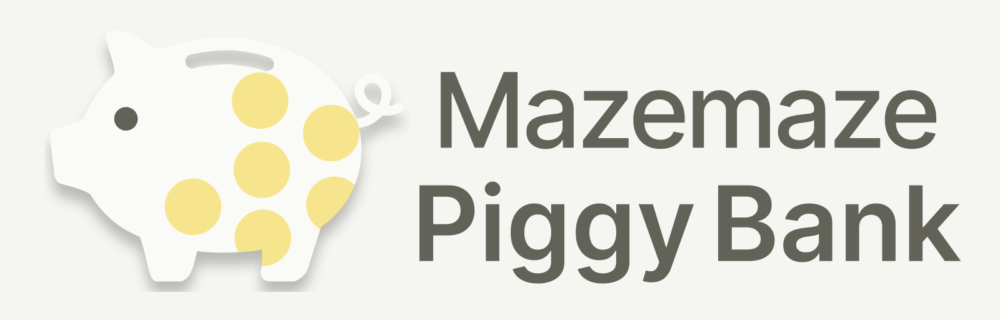

# Mazemaze Piggy Bank

<picture>
  <source media="(prefers-color-scheme: dark)" srcset="docs/brand/lockup-horizontal-dark.png" />
  <source media="(prefers-color-scheme: light)" srcset="docs/brand/lockup-horizontal.png" />
  
</picture>

A Progressive Web App (PWA) designed to manually manage multiple asset accounts and allocate funds to specific "Savings Goals" to track progress.

Instead of using a dedicated backend server, this application adopts a serverless architecture using **Microsoft OneDrive or Google Drive** directly as the data store, prioritizing user privacy and data ownership.

## Documentation

The repository is the canonical workspace for this product.

- [Product Specification](docs/specification.md) — Product / Domain / Storage / Persistence / Sharing / UI / UX / PWA requirements and behavior
- [Brand Specification](docs/brand/README.md) — Naming, colors, icon, logo / wordmark, and lockup rules
- Code and tests — current implementation and executable behavior

The specification describes the intended product behavior and is not used as a task tracker. When implementation and specification differ, review the difference explicitly rather than recording temporary implementation status inside the specification.

## 📖 Overview & Purpose

This app is not just an expense tracker or a simple asset manager; it focuses on clarifying "which asset is reserved for what purpose."

- **Asset Allocation**: Manually link assets (Positions such as Cash, Bank Deposits, Investment Funds) to specific Goals (e.g., Travel, Big Purchases) by assigning reserved amounts (Allocations).
- **Market Value Adjustment**: When the market value of an asset (e.g., Investment Trust) is updated, the allocated amounts linked to that asset are **recalculated according to the Position's allocation mode**.
- **Sharing**: Manage a "Shared Pool Account" and "Shared Goals" with partners or family members using the selected cloud provider's sharing capabilities.

## ✨ Features

- **Personal Microsoft / Google Accounts**: No proprietary account registration required.
- **Fully Serverless (Client-to-Cloud)**: User data is stored in the selected personal OneDrive or Google Drive instead of an application-owned database.
- **Mobile First**: UI designed for one-handed operation on smartphones.
- **Microsoft Fluent UI**: Adopts a design system that is both friendly and professional.
- **Offline Viewing**: Browse the latest cached data even without an internet connection (Editing is disabled offline).
- **Selectable Storage Provider**: OneDrive or Google Drive; one provider is active at a time and the app does not dual-write.
- **Dark Mode**: Supports system / light / dark appearance preferences.
- **Sharing Permissions**: Shared workspaces respect read/write capability in the UI.
- **Data Portability**: Export / Import and storage-provider Move flows are available for supported data.

## 🛠 Tech Stack

- **Frontend**: Next.js / React / TypeScript
- **UI Framework**: Fluent UI
- **Microsoft Auth & Storage**: Microsoft Graph API (OneDrive) / MSAL
- **Google Auth & Storage**: Google Identity Services / Google Drive API
- **Data Strategy**: Snapshot (Latest State) + Event history (Logs) + Lease
- **Export / Import**: ZIP-based data portability

## ⚠️ Constraints & Scope

This app focuses on digitizing "personal manual management" and explicitly excludes the following features:

1.  **No Automatic Sync**: No bank APIs or scraping. All balances and market values are entered manually.
2.  **JPY (Integer) Only**: Foreign currencies and investment funds are handled as integer JPY values (converted manually at input).
3.  **Conflict Resolution (First-in Wins)**:
    - The app does not support simultaneous editing or automatic merging.
    - Optimistic generation / ETag-style checks are used where available. A detected mismatch fails the save and requires reloading the latest data.
4.  **No Real-time Sync**: While a "Lease" file is used to show an "Editing" status to others, strictly real-time locking or synchronization is not implemented. Lease information is a best-effort status aid; lease failures must not block editing or saving.

## 📁 Data Storage

Data is stored in the user's selected OneDrive or Google Drive in the following structure.
**Note**: Deleting the app root folder removes the cloud data under it and resets that workspace. Use **Export** in Settings before deleting cloud files to keep a backup.

- **Snapshot**: A normalized JSON file holding the current state of Accounts, Positions, Goals, and Allocations.
- **Events**: Chunked log files for auditing and recovery.
- **Lease**: Temporary files used to show editing status for concurrent editing conflicts.
- **Shared data**: Shared workspaces created by the user live under the selected app root's `shared/` folder. Shared workspaces can also be opened through cloud-provider sharing capabilities.

Default app roots:

- **OneDrive**: `/Apps/Mazemaze Piggy Bank/`
- **Google Drive**: `/My Drive/Apps/MazemazePiggyBank/`

The product specification defines the authoritative folder, pointer, Snapshot, EventChunk, Lease, shared-root, and portability behavior. Do not treat folder names alone as the identity of a workspace where the specification defines an ID / pointer-based identity.

Import overwrites existing data. Move copies supported data to the destination provider and then deletes source data; review the confirmation and export a backup first.

---

> **Note**
> While designed as a PWA for mobile use, this application is fully functional on desktop browsers. Recommended browsers: Latest Chrome, Edge, Safari.

## ✅ Setup

```bash
npm install
```

Create your local env file:

```bash
cp .env.example .env.local
```

## 🔐 Microsoft Sign-in Setup

Microsoft sign-in supports **Personal Microsoft accounts only**.

1. Create a Microsoft Entra app registration for personal Microsoft accounts and add the Single-page application (SPA) platform.
2. Add a redirect URI for local development (for example, `http://localhost:3000`) and each deployed environment. Each URI must match that environment's `NEXT_PUBLIC_MSAL_REDIRECT_URI`.
3. Configure delegated Microsoft Graph permissions:
   - `User.Read`
   - `Files.ReadWrite`
4. Update `.env.local` with your values:
   - `NEXT_PUBLIC_MSAL_CLIENT_ID` (required for Microsoft sign-in)
   - `NEXT_PUBLIC_MSAL_REDIRECT_URI` (required for Microsoft sign-in)
   - `NEXT_PUBLIC_MSAL_AUTHORITY` (optional; default: `https://login.microsoftonline.com/consumers`)
   - `NEXT_PUBLIC_ONEDRIVE_APP_ROOT` (optional app root label; default: `/Apps/Mazemaze Piggy Bank/`)

Microsoft sign-in reports a configuration error if the Client ID or Redirect URI is missing. `NEXT_PUBLIC_ONEDRIVE_APP_ROOT` is a display label; OneDrive storage uses the Microsoft Graph app root, so this setting does not relocate it.

### OneDrive Smoke Test

This optional check verifies the OneDrive connection after setup:

1. Start the dev server.
2. Open **Settings**.
3. Sign in with Microsoft, select OneDrive as the active provider, and confirm the status shows your account. Open **Advanced / Diagnostics**, then **Storage checks**.
4. Run **Check app folder**.
5. Run **Write test file** and **Read test file**.

The test file name is `pb-test.json` under the app folder. **Write test file** creates or overwrites it; run **Read test file** afterward and confirm both checks succeed.

## 🔐 Google Sign-in Setup

The product supports **personal Google accounts**.

1. Create or select a Google Cloud project and enable the **Google Drive API**.
2. Configure OAuth branding, audience, and consent settings. If the app is in testing, add the accounts that will test it as test users.
3. Create an OAuth Client ID with application type **Web application**.
4. Add local and deployed origins to **Authorized JavaScript origins**, including `http://localhost:3000` for local development and the dev / production origins you use.
5. Update `.env.local` with your values:
   - `NEXT_PUBLIC_GOOGLE_CLIENT_ID` (required)
   - `NEXT_PUBLIC_GOOGLE_DRIVE_APP_ROOT` (optional; default: `/My Drive/Apps/MazemazePiggyBank/`)

Google sign-in reports a configuration error if the Client ID is missing. The implementation uses Google Identity Services' browser token flow and requests `openid`, profile / email scopes, `drive.file`, and `drive.appdata`. App-data access is used for pointer storage.

See Google's [OAuth setup requirements](https://developers.google.com/identity/protocols/oauth2/javascript-implicit-flow) for API enablement and authorized origins, and the [Google Identity Services setup guide](https://developers.google.com/identity/gsi/web/guides/get-google-api-clientid) for client configuration.

## ▶️ Development

```bash
npm run dev
```

Open [http://localhost:3000](http://localhost:3000).

## Development / Test Data Reset

During development, incompatible data does not require migration or recovery. Reset disposable workspaces when needed. Use this procedure if incompatible data prevents the application's reset UI from working.

### Before deleting data

- Confirm the cloud account and the actual app folder. Development and production can share cloud data when they use the same account and app registration; different site URLs do not isolate storage.
- Close all app tabs and installed PWA windows on every test device so an old session cannot save data again. Reset only disposable data you own. Deleting a shared workspace also affects its other members.
- Reset the whole app root, including `personal/`, owned workspaces under `shared/`, `events/index.json`, event chunks, leases, and root metadata. Deleting only a snapshot leaves unrelated history and metadata behind. Do not delete the parent `Apps` folder or other applications' data.

### OneDrive

1. Open OneDrive in the browser with the test Microsoft account. Locate the application's folder under `Apps` (the documented default is `Mazemaze Piggy Bank`). The code uses Microsoft Graph's `/me/drive/special/approot`; the actual folder name may differ, especially after renaming or changing the app registration. `NEXT_PUBLIC_ONEDRIVE_APP_ROOT` is only a display label.
2. Confirm the folder contents, then delete that app root. Its `.mpb-pointer.json` is inside the root and is deleted with it. If test roots were manually moved outside it, also remove those identified test roots.
3. Leave unrelated files and the rest of the recycle bin alone. Do not restore the deleted test root during this test. On the next online initialization, the app resolves or creates its app root again.

### Google Drive

1. Open Google Drive in the browser with the test Google account. Locate the actual app root, normally `My Drive/Apps/MazemazePiggyBank` (or the configured Google app root). Confirm its contents and move that root to the trash. A rename alone is not a reset: the app follows folder IDs. Remove any additional disposable test roots with the same name that could be selected during recovery, and any identified test roots moved outside the app root.
2. The pointer `.mpb-pointer.json` is in the hidden `appDataFolder`, **outside** the visible app root. For a full reset, open Drive settings → **Manage apps**, identify this application's OAuth app, and use its hidden-app-data deletion option when available. This clears this app's hidden data, not just one visible workspace. See [Google's hidden app data guidance](https://support.google.com/drive/answer/6374270?hl=en) and [application data folder documentation](https://developers.google.com/workspace/drive/api/guides/appdata).
3. If no hidden-data deletion option is offered, deleting all identified test roots is enough for the current pointer recovery logic: a pointer to a deleted or trashed folder is discarded and rewritten on initialization. If an incompatible future pointer prevents recovery, use an isolated test account/app registration rather than restoring old data. Do not delete unrelated hidden app data or empty the entire trash.

### Clear local state and verify

1. Clear site data for the app's exact origin in the browser (local development, dev deployment, or production as applicable). Include IndexedDB, local/session storage, Cache Storage, and the Service Worker registration. The snapshot database is `mazemaze-piggy-bank`. This also clears local provider/shared-workspace selections and sign-in state. Repeat for each browser/profile or installed PWA used for testing; a hard reload alone is insufficient.
2. Reopen the app online, sign in, select the intended provider, and open Personal. Complete empty-workspace creation if prompted. Confirm there are no old accounts, goals, or history entries. Owned shared workspaces should be gone; workspaces owned by someone else may still appear under `Shared with me` and are not part of this reset.
3. Create a small test account, position, and goal; save an allocation, reload, and check the values and history. If old data reappears, recheck the account, actual root IDs/duplicate folders, and other running sessions. Do not import an incompatible old backup to validate a clean reset.

The reset procedure is manual; no reset is performed by installing dependencies or running tests. The event index is derived from current-format event chunks and may be rebuilt after a failed save or a supported Import / Move; this is not migration of incompatible development data.

## 🔍 Quality Commands

```bash
npm run format
npm run lint
npm run typecheck
npm test
npm run check
```

## 🚀 Deployment

Deployments are performed via **GitHub Actions** using the Vercel CLI.
To avoid double-deploys, Vercel's Git integration deployment should be disabled by `vercel.json`.

Both dev and production workflows run `vercel pull --environment=production`, followed by `vercel build --prod`. Configure application variables in each project's **Production** environment, including the dev project. The workflows retrieve those values; a local `.env.local` file does not configure Vercel. Rebuild and deploy after changing application environment variables.

### Dev environment

The dev environment is intended to be **non-public**. Do not share the dev URL outside collaborators.

#### Vercel Project (dev)

1. Create a dedicated Vercel project for dev.
2. Configure Environment Variables in the **Production** environment of the Vercel project (dev) for the providers you intend to use:
   - `NEXT_PUBLIC_MSAL_CLIENT_ID` (required for Microsoft sign-in)
   - `NEXT_PUBLIC_MSAL_REDIRECT_URI` (set to the dev base URL used by the project)
   - `NEXT_PUBLIC_MSAL_AUTHORITY` (optional; default: `https://login.microsoftonline.com/consumers`)
   - `NEXT_PUBLIC_ONEDRIVE_APP_ROOT` (optional app root label; default: `/Apps/Mazemaze Piggy Bank/`)
   - `NEXT_PUBLIC_GOOGLE_CLIENT_ID` (required for Google sign-in)
   - `NEXT_PUBLIC_GOOGLE_DRIVE_APP_ROOT` (optional; default: `/My Drive/Apps/MazemazePiggyBank/`)

> Note: `NEXT_PUBLIC_MSAL_REDIRECT_URI` must be registered on the Microsoft Entra app as a Redirect URI.

> For Google sign-in, register the dev origin in the Google OAuth client's Authorized JavaScript origins.

#### GitHub Actions (dev)

##### Required GitHub Secrets

Set these secrets in the GitHub repository settings:

- `VERCEL_TOKEN`
- `VERCEL_ORG_ID_DEV`
- `VERCEL_PROJECT_ID_DEV`

##### Workflows

- **Auto deploy on main**: A push to `main` deploys to the dev Vercel project.
- **Manual deploy**: You can deploy any `ref` (branch/tag/SHA) to dev via `workflow_dispatch`.

### Production environment

Production is deployed to a separate Vercel project and is intended to be publicly accessible.

#### Vercel Project (prod)

1. Create a dedicated Vercel project for production.
2. (Optional) Configure a custom domain for production.
3. Configure Environment Variables in the **Production** environment of the Vercel project (prod) for the providers you intend to use:
   - `NEXT_PUBLIC_MSAL_CLIENT_ID` (required for Microsoft sign-in)
   - `NEXT_PUBLIC_MSAL_REDIRECT_URI` (set to the production base URL used by the project)
   - `NEXT_PUBLIC_MSAL_AUTHORITY` (optional; default: `https://login.microsoftonline.com/consumers`)
   - `NEXT_PUBLIC_ONEDRIVE_APP_ROOT` (optional app root label; default: `/Apps/Mazemaze Piggy Bank/`)
   - `NEXT_PUBLIC_GOOGLE_CLIENT_ID` (required for Google sign-in)
   - `NEXT_PUBLIC_GOOGLE_DRIVE_APP_ROOT` (optional; default: `/My Drive/Apps/MazemazePiggyBank/`)

> Note: You can use the same Entra app registration for dev and prod, but separate registrations are recommended for isolation.
> If you use a single registration, keep Redirect URIs minimal and do not register preview URLs.

> For Google sign-in, register the production origin in the Google OAuth client's Authorized JavaScript origins.

#### GitHub Actions (prod)

##### Required GitHub Secrets

Add these additional secrets for production:

- `VERCEL_TOKEN`
- `VERCEL_ORG_ID_PROD`
- `VERCEL_PROJECT_ID_PROD`

`VERCEL_TOKEN` is required for production deployments. Treat it as highly sensitive.

##### Workflows

- **Tag deploy**: A push of a tag matching `v*` (e.g. `v1.2.3`) deploys to production. This workflow has no manual `workflow_dispatch` trigger.

Example:

```bash
git tag v1.0.0
git push origin v1.0.0
```

## 📌 Project Constraints

- UI text and code comments must be written in English only. Japanese is a future localization target defined in the product specification.
- Personal Microsoft and personal Google accounts only (no work or school accounts).
- Offline mode is view-only; editing is disabled.
- No telemetry or analytics are added by default.
